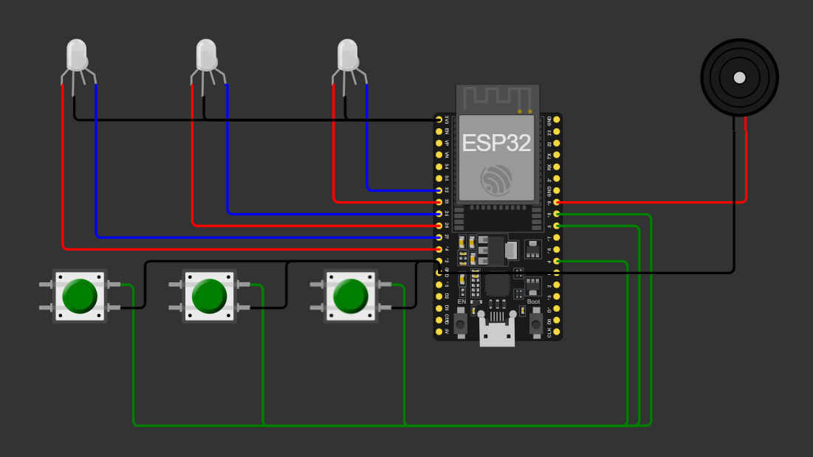

# AlertBox

AlertBox é um projeto desenvolvido para auxiliar na organização de horários de medicação no dia a dia. Sempre que um dos horários pré-definidos é atingido, o sistema dispara um buzzer e acende um LED vermelho, alertando o usuário. Ao pressionar o botão correspondente, o LED muda para azul e o buzzer para de tocar.

## Funcionalidades

- Configuração de múltiplos horários de alerta.
- Indicação visual com LEDs RGB.
- Indicação sonora com buzzer.
- Reset automático à meia-noite para os alertas do dia seguinte.

## Componentes
| Quantidade | Componente     |
| ---------- | -------------- |
| 1          | ESP32          |
| 3          | Push Buttons   |
| 3          | LEDs RGB Anode |
| 1          | Buzzer         |
| 17         | Jumpers        |

## Montagem

- Conecte os LEDs, botões e buzzer nos pinos correspondentes do ESP32 conforme a tabela acima.
- Ajuste o código para definir os horários de alerta.
- Conecte o ESP32 via USB para alimentar o circuito ou utilize uma fonte externa.

| Componente | Pino ESP32 | Função                   |
| ---------- | ---------- | ------------------------ |
| LED1 Red   | 33         | Controle do LED vermelho |
| LED1 Blue  | 32         | Controle do LED azul     |
| LED2 Red   | 26         | Controle do LED vermelho |
| LED2 Blue  | 25         | Controle do LED azul     |
| LED3 Red   | 14         | Controle do LED vermelho |
| LED3 Blue  | 27         | Controle do LED azul     |
| Botão1     | 4          | Desativar LED1/buzzer    |
| Botão2     | 5          | Desativar LED2/buzzer    |
| Botão3     | 18         | Desativar LED3/buzzer    |
| Buzzer     | 19         | Sinal sonoro             |

Todos os LEDs devem ter o pino comum (COM) conectado ao GND.

